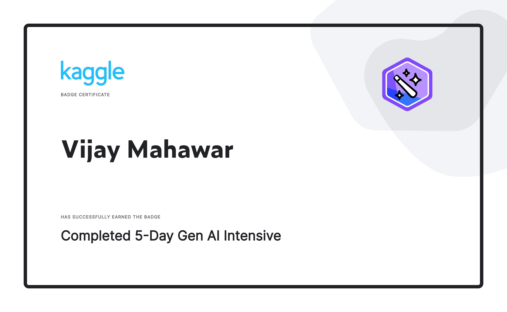

# [Kaggle 5 day GenAI Course](https://www.kaggle.com/learn-guide/5-day-genai)

## Day 0
### [Troubleshooting and FAQs](https://www.kaggle.com/code/markishere/day-0-troubleshooting-and-faqs/notebook)
### [How to use Kaggle Public API](https://www.kaggle.com/docs/api)

## Day 1 (Foundational Large Language Models & Prompt Engineering)
Welcome to Day 1.

Today you’ll explore the evolution of LLMs, from transformers to techniques like fine-tuning and inference acceleration. You’ll also get trained in the art of prompt engineering for optimal LLM interaction.

The code lab will walk you through getting started with the Gemini API and cover several prompt techniques and how different parameters impact the prompts.

## Day 1 Assignments:

### 1. Complete the Intro Unit: “Foundational Large Language Models”:

  - [Optional] Listen to the summary [podcast episode](https://youtu.be/mQDlCZZsOyo) for this unit (created by [NotebookLM](https://notebooklm.google.com/)).

  - Read the [Foundational Large Language Models & Text Generation](https://www.kaggle.com/whitepaper-foundational-llm-and-text-generation) whitepaper.([📖PDF](./Day-1/Whitepaper-Foundational-LLMs-Text-Generation.pdf)

### 2. Complete Unit 1 – [“Prompt Engineering”](./Prompt-Engineering.pdf), which is:

  - [Optional] Listen to the summary [podcast episode](https://youtu.be/F_hJ2Ey4BNc) for this unit (created by NotebookLM).

  - Read the [“Prompt Engineering” whitepaper](https://www.kaggle.com/whitepaper-prompt-engineering).(📖[PDF](./Day-1/Prompt-Engineering.pdf))

  - Complete [this code lab](https://www.kaggle.com/code/markishere/day-1-prompting) on Kaggle where you’ll learn prompting fundamentals. Make sure you [phone verify](https://www.kaggle.com/settings) your account before starting, it's necessary for the code labs.

  - [Optional] [Read this case study](https://cloud.google.com/blog/products/ai-machine-learning/how-commerzbank-is-transforming-financial-advisory-workflows-with-gen-ai?e=48754805) to learn how a leading bank leveraged advanced prompt engineering and other contents discussed in assignments of day 1 to automate their financial advisory workflows, achieving significant productivity gains.

### 3. Watch the [YouTube livestream recording](https://www.youtube.com/watch?v=kpRyiJUUFxY&list=PLqFaTIg4myu-b1PlxitQdY0UYIbys-2es&index=1&t=13s). 
   - [Paige Bailey](https://www.linkedin.com/in/dynamicwebpaige/) will be joined by expert from Google 
   - [Mohammadamin Barekatain](https://www.linkedin.com/in/aminbarekatain/), 
   - [Lee Boonstra](https://www.linkedin.com/in/leeboonstra/), 
   - [Logan Kilpatrick](https://www.linkedin.com/in/logankilpatrick/), 
   - [Daniel Mankowitz](https://www.linkedin.com/in/daniel-j-mankowitz-96a25a46/), 
   - [Majd Merey Al](https://www.linkedin.com/in/majdalmerey/), 
   - [Anant Nawalgaria](https://www.linkedin.com/in/anant-nawalgaria/), 
   - [Aliaksei Severyn](https://www.linkedin.com/in/aseveryn/) and 
   - [Chuck Sugnet](https://www.linkedin.com/in/chuck-sugnet/) to discuss today's readings and code labs.

## Day 2 (Embeddings and Vector Stores/Databases)

Welcome to Day 2.

Today you will learn about the conceptual underpinning of embeddings and vector databases and how they can be used to bring live or specialist data into your LLM application. You’ll also explore their geometrical powers for classifying and comparing textual data.

Day 2 Assignments:

1. Complete Unit 2: “Embeddings and Vector Stores/Databases”, which is:

 [Optional] Listen to the summary [podcast episode](https://youtube.com/watch?v=1CC39K76Nqs) for this unit (created by [NotebookLM](https://notebooklm.google.com/)).
 Read the “[Embeddings and Vector Stores/Databases](https://www.kaggle.com/whitepaper-embeddings-and-vector-stores)” whitepaper 📖[PDF](./Day-2/Whitepaper-Emebddings-Vectorstores.pdf).
 Complete these code labs on Kaggle:
 1. [Build](https://www.kaggle.com/code/markishere/day-2-document-q-a-with-rag) a RAG question-answering system over custom documents
 2. [Explore](https://www.kaggle.com/code/markishere/day-2-embeddings-and-similarity-scores) text similarity with embeddings
 3. [Build](https://www.kaggle.com/code/markishere/day-2-classifying-embeddings-with-keras) a neural classification network with Keras using embeddings
2. Watch [the YouTube livestream recording](https://www.youtube.com/watch?v=86GZC56rQCc&list=PLqFaTIg4myu-b1PlxitQdY0UYIbys-2es&index=2). 
   - [Paige Bailey](https://www.linkedin.com/in/dynamicwebpaige/) will be joined by expert speakers from Google 
   - [Omid Fatemieh](https://www.linkedin.com/in/omid-fatemieh/), 
   - [Jinhyuk Lee](https://www.linkedin.com/in/leejnhk/), 
   - Alan Li, 
 - [Iftekhar Naim](https://www.linkedin.com/in/iftekhar-naim-6a85664/), 
   - [Anant Nawalgaria](https://www.linkedin.com/in/anant-nawalgaria/), 
   - [Yan Qiao](https://www.linkedin.com/in/qiaoyan/), and 
   - [Xiaoqi Ren](https://www.linkedin.com/in/xiaoqi-ren-898033a5/) to discuss embeddings and vector stores/databases.

## Day 3 (Generative Agents)

Welcome to Day 3.

Learn to build sophisticated AI agents by understanding their core components and the iterative development process.
The code labs cover how to connect LLMs to existing systems and to the real world. Learn about function calling by giving SQL tools to a chatbot, and learn how to build a LangGraph agent that takes orders in a café.

## Day 3 Assignments:

### 1. Complete Unit 3: “Generative Agents”, which is:

   - [Optional] Listen to the summary [podcast episode](https://www.youtube.com/watch?v=H4gZd4BCrDQ) for this unit (created by NotebookLM).
   - Read the ["Generative AI Agents"](https://www.kaggle.com/whitepaper-agents) whitepaper.📖[PDF](./Day-3/Whitepaper-Agents.pdf)
   - [Optional] Read a [case study](https://cloud.google.com/blog/products/ai-machine-learning/regnology-automates-ticket-to-code-with-genai-on-vertex-ai?e=48754805) which talks about how a leading technology regulatory reporting solutions provider used an agentic generative AI system to automate ticket-to-code creation in software development, achieving a 2.5x productivity boost.
   - Complete these code labs on Kaggle:
     - 1. [Talk](https://www.kaggle.com/code/markishere/day-3-function-calling-with-the-gemini-api) to a database with function calling
     - 2. [Build](https://www.kaggle.com/code/markishere/day-3-building-an-agent-with-langgraph/) an agentic ordering system in LangGraph

### 2. Watch the YouTube livestream recording. 
   - [Paige Bailey](https://www.linkedin.com/in/dynamicwebpaige/) will be joined by expert 
   - Steven Johnson, 
   - Julia Wiesinger, 
   - Alan Blount, 
   - Patrick Marlow, 
   - Wes Dyer, 
   - Anant Nawalgaria to discuss generative AI agents.

## Day 4 (Domain-Specific LLMs)

Welcome to Day 4.

In today’s reading, you’ll delve into the creation and application of specialized LLMs like SecLM and MedLM/Med-PaLM, with insights from the researchers who built them.

In the code labs you will learn how to add real world data to a model beyond its knowledge cut-off by grounding with Google Search. You will also learn how to fine-tune a custom Gemini model using your own labeled data to solve custom tasks.

Day 4 Assignments:

1. Complete Unit 4: “Domain-Specific LLMs”, which is:

   - [Optional] Listen to the summary [podcast episode](https://www.youtube.com/watch?v=b1a4ZOQ8XdI) for this unit (created by NotebookLM).
   - Read the [“Solving Domain-Specific Problems Using LLMs”](https://www.kaggle.com/whitepaper-solving-domains-specific-problems-using-llms) whitepaper".📖[PDF](./Day-4/Whitepaper-Solving-Domain-Specific-problems-using-LLMs.pdf)
   - Complete these code labs on Kaggle:
     - 1.[Use](https://www.kaggle.com/code/markishere/day-4-google-search-grounding) Google Search data in generation
     - 2.[Tune](https://www.kaggle.com/code/markishere/day-4-fine-tuning-a-custom-model) a Gemini model for a custom task
2. Watch the YouTube livestream recording. 
   - [Paige Bailey](https://www.linkedin.com/in/dynamicwebpaige/) will be joined by expert 
   - Scott Coull, 
   - Antonio Gulli, 
   - Anant Nawalgaria, 
   - Christopher Semturs, and 
   - Umesh Shankar. to discuss domain specific models.

## Day 5 (MLOps for Generative AI)

Welcome to Day 5.

Discover how to adapt MLOps practices for Generative AI and leverage Vertex AI's tools for foundation models and generative AI applications.

Day 5 Assignments:

1. Complete Unit 5: “MLOps for Generative AI”, which is:

   - [Optional] Listen to the summary [podcast episode](https://youtu.be/k9S6IhiUUj4) for this unit (created by NotebookLM).
   - Read the [“MLOps for Generative AI”](https://www.kaggle.com/whitepaper-operationalizing-generative-ai-on-vertex-ai-using-mlops) whitepaper.📖[PDF](./Day-5/Gen-AI-Day-5-Whitepaper-Operationalizing-Generative-AI-on-Vertex-AI.pdf)
   - No code lab for today! We will do a code walkthrough and live [demo of goo.gle/e2e-gen-ai-app-starter-pack](https://github.com/GoogleCloudPlatform/agent-starter-pack), a resource created for making MLOps for Gen AI easier and accelerating the path to production. Please go through the repository in advance.

2. Watch the YouTube livestream recording. 
   - [Paige Bailey](https://www.linkedin.com/in/dynamicwebpaige/) will be joined by expert 
   - Advait Bopardikar, 
   - Sokratis Kartakis, 
   - Gabriela Hernandez Larios, 
   - Veer Muchandi, 
   - Anant Nawalgaria, 
   - Elia Secchi, and 
   - Olivia Wiles to discuss MLOps practices for generative AI.

 ## Bonus Day

 - [Notebook](./Bonus-Day/gen-ai-bonus-day-extra-api-features-to-try.ipynb)

 ## Capstone Project
  
   - [Mental Health and Wellbeing Summary](./Day-6-Capstone-Project/Mental_Health_Capstone_Project.pdf)
   - [Notebook](./Day-6-Capstone-Project/gen-ai-capstone-2025-q1-mental-health.ipynb)

 ### Acknowledgments:

I extend my heartfelt gratitude 🙏 to the Kaggle community, all the faculties, experts, trainers—especially [Paige Bailey](https://www.linkedin.com/in/dynamicwebpaige/), [Anant Nawalgaria](https://www.linkedin.com/in/anant-nawalgaria/), and [Mark McDonald](https://www.linkedin.com/in/markmcdonald0/) — for their invaluable guidance and insightful training notebooks during the Kaggle 5-day GenAI Course. Their support has been instrumental in making this project possible.

For more about the course, please visit Kaggle 5-day GenAI Course.

Blog Post: [Harnessing Generative AI to Understand Mental Health](https://whizdba.wordpress.com/2025/04/07/harnessing-generative-ai-to-understand-mental-health-a-capstone-journey/)