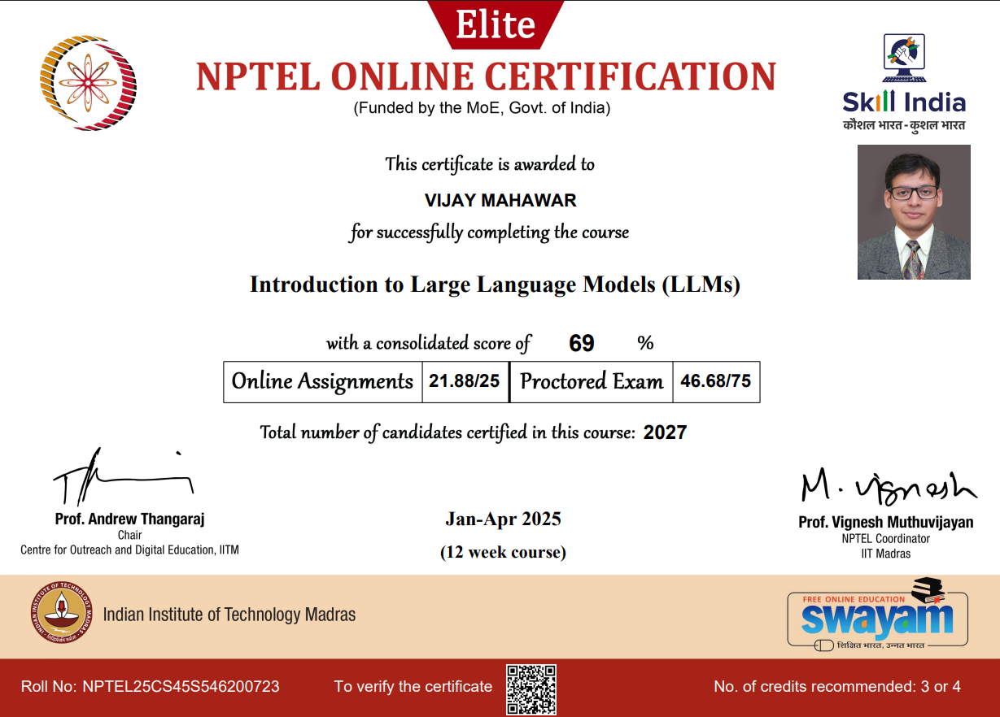

# 📘 Natural Language Processing & LLMs — Course

Welcome to the comprehensive repository of lecture slides and notebooks on **Natural Language Processing**, **Language Models**, and **Knowledge Graphs**, compiled from a semester-long graduate-level course.

This repository is organized by week and covers foundational concepts, cutting-edge research, and practical insights into modern NLP and LLM techniques.

---

## 📚 Table of Contents

- [Week 1: Introduction to NLP](#week-1-introduction-to-nlp)
- [Week 2: Statistical Language Models](#week-2-statistical-language-models)
- [Week 3: PyTorch Practice](#week-3-pytorch-practice)
- [Week 4: Word Representations & Tokenization](#week-4-word-representations--tokenization)
- [Week 5: Neural Language Models & Seq2Seq](#week-5-neural-language-models--seq2seq)
- [Week 6: Transformers](#week-6-transformers)
- [Week 7: Pre-training Strategies](#week-7-pre-training-strategies)
- [Week 8: Prompting & Alignment](#week-8-prompting--alignment)
- [Week 9: Knowledge Graph Embeddings I](#week-9-knowledge-graph-embeddings-i)
- [Week 10: Interpretability & Model Optimization](#week-10-interpretability--model-optimization)
- [Week 11: Knowledge Graph Embeddings II](#week-11-knowledge-graph-embeddings-ii)
- [Week 12: Responsible LLMs](#week-12-responsible-llms)

---

## Week 1: Introduction to NLP

- [Week-1-Lec\_1-Course-Introduction.pdf](./slides/Week-1-Lec_1-Course-Introduction.pdf)\
  Overview of the course structure, grading, and learning objectives. Highlights the motivation behind studying NLP and its relevance in real-world applications. Introduces basic terminologies and the spectrum of NLP problems from syntactic to semantic analysis.

- [Week-1-Lec\_2-NLP-Introduction.pdf](./slides/Week-1-Lec_2-NLP-Introduction.pdf)\
  A historical journey through NLP advancements. Covers the evolution from rule-based systems to statistical and neural approaches. Provides insights into language ambiguities, tokenization, and common linguistic preprocessing techniques.

---

## Week 2: Statistical Language Models

- [Week-2-Lec\_3-Statistical-LM-Introduction.pdf](./slides/Week-2-Lec_3-Statistical-LM-Introduction.pdf)\
  Fundamentals of n-gram language models, chain rule, and the importance of context. Discusses the independence assumptions and limitations of n-gram approaches, setting the stage for deeper models.

- [Week-2-Lec\_4-Statistical-LM-Smoothing-Evaluation.pdf](./slides/Week-2-Lec_4-Statistical-LM-Smoothing-Evaluation.pdf)\
  Focus on data sparsity and solutions using smoothing techniques like Laplace, Good-Turing, and Kneser-Ney. Introduction to perplexity as a standard metric for model evaluation.

---

## Week 3: PyTorch Practice

- [Week-3-Jupyter-Notebook-Practice-Pytorch.ipynb](./slides/Week-3-Jupyter-Notebook-Practice-Pytorch.ipynb)\
  Practical hands-on with PyTorch covering tensor operations, auto-grad, defining simple neural networks, loss functions, and optimization. Lays the foundation for implementing custom models for NLP tasks.

---

## Week 4: Word Representations & Tokenization

- [Week-4-Lec\_7-Word-Representation.pdf](./slides/Week-4-Lec_7-Word-Representation.pdf)\
  Introduction to distributional semantics. Explanation of Word2Vec training objectives: Skip-gram and CBOW. Concepts of vector similarity and semantic encoding in dense embeddings.

- [Week-4-Lec\_8-Word-Representation-GloVe.pdf](./slides/Week-4-Lec_8-Word-Representation-GloVe.pdf)\
  Discusses matrix factorization methods for word embeddings. Shows how GloVe captures global co-occurrence statistics while learning vector representations.

- [Week-4-Lec\_9-Tokenization-Strategies.pdf](./slides/Week-4-Lec_9-Tokenization-Strategies.pdf)\
  Tokenization strategies in modern NLP: Byte-Pair Encoding (BPE), Unigram, and WordPiece. Trade-offs in vocabulary size, model capacity, and subword representations.

---

## Week 5: Neural Language Models & Seq2Seq

- [Week-5-Lec\_10-Natural-Language-Models.pdf](./slides/Week-5-Lec_10-Natural-Language-Models.pdf)\
  Overview of neural architectures applied to language modeling. Highlights RNNs, CNNs, and dense networks for sequence prediction.

- [Week-5-Lec\_11-Neural-Language-Models.pdf](./slides/Week-5-Lec_11-Neural-Language-Models.pdf)\
  LSTMs and GRUs explained for handling long sequences. Compares their performance and training challenges in NLP tasks.

- [Week-5-Lec\_12-Seq2Seq-Modelling.pdf](./slides/Week-5-Lec_12-Seq2Seq-Modelling.pdf)\
  Encoder-decoder framework. Application of Seq2Seq in translation, summarization, and dialogue systems.

- [Week-5-Lec\_13-Decoding-Strategies.pdf](./slides/Week-5-Lec_13-Decoding-Strategies.pdf)\
  Decoding methods: Greedy, Beam Search, Sampling. Explores performance trade-offs and practical implications in text generation.

- [Week-5-Lec\_14-Attention-in-Seq2Seq-Models.pdf](./slides/Week-5-Lec_14-Attention-in-Seq2Seq-Models.pdf)\
  Attention mechanism's role in improving encoder-decoder performance. Visualizing alignment and context vectors.

---

## Week 6: Transformers

- [Week-6-Lec\_15-Transformer-Introduction-1.pdf](./slides/Week-6-Lec_15-Transformer-Introduction-1.pdf)\
  Introduction to the Transformer architecture and its motivation. Covers self-attention, positional encoding, and why recurrence can be avoided in deep NLP.

- [Week-6-Lec\_16--Transformer-Introduction-2.pdf](./slides/Week-6-Lec_16--Transformer-Introduction-2.pdf)\
  Explains key architectural components including multi-head attention, residual connections, and layer normalization. Forms the foundation of modern LLMs.

- [Week-6-Jupyter-Notebook-Transformer-Demo.ipynb](./slides/Week-6-Jupyter-Notebook-Transformer-Demo.ipynb)\
  Interactive demo notebook to implement a toy Transformer model. Useful for understanding self-attention computation and forward propagation through transformer blocks.

## Week 7: Pre-training Strategies

- [Week-7-Lec\_18-Pre-Training-Strategies-ELMo-BERT.pdf](./slides/Week-7-Lec_18-Pre-Training-Strategies-ELMo-BERT.pdf)\
  Explores the shift from static to contextual embeddings using ELMo and BERT. Discusses masked language modeling and next sentence prediction.

- [Week-7-Lec\_19-Pre-Training-Strategies-EncodeDecorder-Decoder-only.pdf](./slides/Week-7-Lec_19-Pre-Training-Strategies-EncodeDecorder-Decoder-only.pdf)\
  Covers architectural varieties in pretraining: encoder-only, decoder-only, and encoder-decoder frameworks. Examples include BART, T5, GPT.

- [Week-7-Jupyter-Notebook-Hugging-Face.ipynb](./slides/Week-7-Jupyter-Notebook-Hugging-Face.ipynb)\
  Practical walkthrough for using Hugging Face Transformers to load models, fine-tune on custom tasks, and evaluate model performance.

## Week 8: Prompting & Alignment

- [Week-8-Lec\_21-Instruction-Tuning.pdf](./slides/Week-8-Lec_21-Instruction-Tuning.pdf)\
  Explains how LLMs can be made to follow user instructions using supervised fine-tuning on instruction datasets.

- [Week-8-Lec\_22-Prompt-based-Learning.pdf](./slides/Week-8-Lec_22-Prompt-based-Learning.pdf)\
  Introduces prompt engineering techniques like zero-shot and few-shot prompting. Emphasizes task formulation through language.

- [Week-8-Lec\_23-Advanced-Prompting-and-Prompt-Sensitivity.pdf](./slides/Week-8-Lec_23-Advanced-Prompting-and-Prompt-Sensitivity.pdf)\
  Advances in prompting like Chain-of-Thought, Tree-of-Thought, and Graph-of-Thought. Discusses the metric POSIX for measuring prompt sensitivity.

- [Week-8-Lec\_24-Alignment-of-Language-Models-1.pdf](./slides/Week-8-Lec_24-Alignment-of-Language-Models-1.pdf)\
  Overview of model alignment, RLHF, and how human preferences shape model outputs. Key focus on instruction-following.

- [Week-8-Lec\_25-Alignment-of-Language-Models-2.pdf](./slides/Week-8-Lec_25-Alignment-of-Language-Models-2.pdf)\
  Technical deep dive into optimization algorithms for alignment: REINFORCE, PPO, reward models, and training challenges.

## Week 9: Knowledge Graph Embeddings I

- [Week-9-Lec\_26-Knowledge-and-Retrieval-Knowledge-Graph.pdf](./slides/Week-9-Lec_26-Knowledge-and-Retrieval-Knowledge-Graph.pdf)\
  Introduces knowledge graphs (KGs), their structure, and motivation. Discusses real-world use cases like semantic search and QA.

- [Week-9-Lec\_27-Knowledge-and-Retrieval-KG-Completion-Eval.pdf](./slides/Week-9-Lec_27-Knowledge-and-Retrieval-KG-Completion-Eval.pdf)\
  Describes KG completion tasks, evaluation metrics such as MRR and Hits\@k, and challenges like entity disambiguation.

- [Week-9-Lec\_28-Knowledge-and-Retrieval-Translation-and-Rotation.pdf](./slides/Week-9-Lec_28-Knowledge-and-Retrieval-Translation-and-Rotation.pdf)\
  Describes models like TransE, TransH, and RotatE that learn embeddings by translating or rotating vectors across relations.

## Week 10: Interpretability & Model Optimization

- [Week-10-Lec\_30-Quantization-Pruning-Distillation.pdf](./slides/Week-10-Lec_30-Quantization-Pruning-Distillation.pdf)\
  Covers compression methods for deploying LLMs efficiently. Explains model size reduction via quantization, pruning, and distillation.

- [Week-10-Lec\_31-Transformers-Alternation-Formulation-Residual-Stream-Perspective.pdf](./slides/Week-10-Lec_31-Transformers-Alternation-Formulation-Residual-Stream-Perspective.pdf)\
  Analyzes transformers from the residual stream viewpoint. Breaks down OV/QK circuits and feature representation across layers.

- [Week-10-Lec\_32-Interpretability-Techniques-Demystifying-the-Black-Box-LMs.pdf](./slides/Week-10-Lec_32-Interpretability-Techniques-Demystifying-the-Black-Box-LMs.pdf)\
  Surveys interpretability tools including probing, attribution, and patching. Offers visual and empirical methods to dissect model behavior.

## Week 11: Knowledge Graph Embeddings II

- [Week-11-Lec\_33-Knowledge-and-Retrieval-Multiplicative-Models.pdf](./slides/Week-11-Lec_33-Knowledge-and-Retrieval-Multiplicative-Models.pdf)\
  Introduction to tensor factorization models like DistMult, ComplEx, and SimplE for link prediction and KG completion.

- [Week-11-Lec\_34-Knowledge-and-Retrieval-Modeling-Hierarchies.pdf](./slides/Week-11-Lec_34-Knowledge-and-Retrieval-Modeling-Hierarchies.pdf)\
  Hierarchical embedding methods using hyperbolic geometry, order embeddings, and box embeddings. Applications in taxonomy modeling.

## Week 12: Responsible LLMs

- [Week-12-Lec\_36-Responsible-LLMs.pdf](./slides/Week-12-Lec_36-Responsible-LLMs.pdf)\
  Highlights ethical concerns in LLMs: bias, fairness, robustness, and safety. Introduces mitigation strategies including adversarial triggers and in-context safety demonstrations.

---

## 🙏 Acknowledgements

This repository contains course content and materials from the **Introduction to Large Language Models** course offered by **IIT Delhi** under the **NPTEL** initiative. All credit goes to the faculty members **Prof. Tanmoy Chakraborty**, **Prof. Soumen Chakrabarti** and lecturers **Anwoy Chatterjee** and **Poulami Ghosh**, and contributors as acknowledged in the slides.

This repo serves solely as an educational reference for learners and researchers.

---

## 🔗 Contact & Resources

- 📘 **Course Source**: [NPTEL - Introduction to Large Language Models](https://nptel.ac.in/)

- 🏫 **Institution**: IIT Madras, IIT Delhi, SWAYAM and NPTEL

- 👨‍🏫 **Lead Instructor**: [Prof. Tanmoy Chakraborty](https://www.linkedin.com/in/tanmoy-chakraborty-89553324) and [Prof. Soumen Chakrabarti](https://www.linkedin.com/in/soumen-chakrabarti-6555b4)

- 🌐 **Course Assistant**: [Poulami Ghosh](https://www.linkedin.com/in/poulamighosh/) and [Anwoy Chatterjee](https://www.linkedin.com/in/anwoy-chatterjee/)
---

## 🤝 Connect with Me

- 🌐 **Website**: [www.vijay.mahawar.net](https://www.vijay.mahawar.net)

- 💼 **LinkedIn**: [linkedin.com/in/vijay-mahawar](https://www.linkedin.com/in/vijay-mahawar/)

